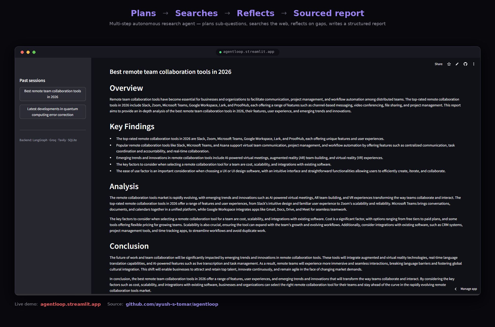
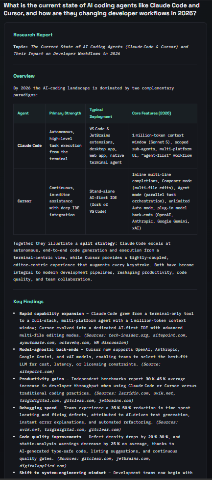
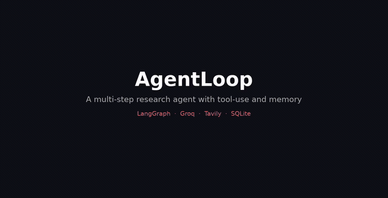

# Think_Agent

**A multi-step research agent with tool-use and memory.**

Most AI projects are input → output. Think_Agent is different — it plans, searches the live web, reflects on its own gaps, loops back if needed, then writes a structured report. Built to demonstrate agentic AI, not just LLM wrapping.

**Plans → Searches → Reflects → Sourced report**


🔗 **[Live Demo](https://agentloop.onrender.com/)** · 📦 **[Source](https://github.com/paliwalsambhav/agentloop)**

**Maintainer:** Sambhav Paliwal



**Report output:**



**See it run:**



<details>
<summary><strong>▶ Watch the full demo video (with narrated pipeline steps)</strong></summary>
<br>

https://github.com/user-attachments/assets/f8e0bd8c-a485-493b-89b4-2ca57ce30db5

</details>

---

## Known limitations

- **Ephemeral memory on Render's free tier** — the SQLite long-term memory resets on redeploy/restart, since the filesystem isn't persistent. Long-term memory works correctly within a session/uptime window, but won't survive a cold restart. Swapping in a hosted Postgres (e.g. Supabase) fixes this — see "What I'd add next."
- **Free-tier cold starts** — the service spins down on inactivity, so the first request after idle can take 30–50s to respond.
- **Single tool** — the agent currently only has `web_search` available, so tool *selection* isn't demonstrated, only tool *invocation timing* (whether to search or not per sub-question).

---

## What it does

Give it any topic. The agent runs a 6-step pipeline autonomously:

| Step | What happens |
|------|-------------|
| **Recall** | Checks SQLite long-term memory for related past research |
| **Plan** | LLM breaks the topic into specific sub-questions |
| **Research** | For each sub-question, LLM *decides* whether to call `web_search` (Tavily), reads results, writes a cited answer |
| **Reflect** | Re-reads its own notes, identifies gaps, loops back to research if needed |
| **Synthesize** | Writes a structured markdown report from everything gathered |
| **Persist** | Saves the run to long-term memory for future recall |

```
START → recall → planner → research ←─────────┐
                               │               │ (loop while sub-questions remain)
                               ▼               │
                            reflect ───────────┘ (loop back if gaps found)
                               │
                               ▼
                          synthesize → persist → END
```

---

## Stack

| Layer | Technology |
|-------|-----------|
| Agent framework | LangGraph (StateGraph with conditional edges) |
| LLM + tool-calling | Groq (`openai/gpt-oss-20b` fast / `openai/gpt-oss-120b` reasoning, configurable) |
| Web search tool | Tavily API |
| UI | Static HTML/CSS/JS (server-sent events for live progress) |
| Long-term memory | SQLite |
| Deploy | Render |

---

## Project structure

```
Think_Agent/
├── main.py               FastAPI app — /api/run (SSE stream), /api/sessions, serves static/
├── agent/
│   ├── state.py         AgentState schema shared across all graph nodes
│   ├── graph.py         LangGraph StateGraph: nodes + conditional routing
│   ├── llm.py           LLM wrapper: plain completions + tool-calling loop
│   └── tools.py         web_search tool (Tavily) + OpenAI-compatible schema
├── memory/
│   └── store.py         SQLite long-term memory (save, recall, clear past sessions)
├── static/
│   └── index.html      Frontend — input, live trace, report renderer, session history
├── requirements.txt
└── .env.example
```

---

## Run locally

```bash
# 1. Clone and enter the project
git clone https://github.com/paliwalsambhav/agentloop.git Think_Agent
cd Think_Agent

# 2. Create virtual environment (Python 3.11+ required)
python3.11 -m venv venv
source venv/bin/activate        # Windows: venv\Scripts\activate

# 3. Install dependencies
pip install -r requirements.txt

# 4. Add your API keys
cp .env.example .env
# then edit .env and set:
# GROQ_API_KEY=your_groq_api_key_here
# TAVILY_API_KEY=your_tavily_api_key_here
# GROQ_REASON_MODEL=openai/gpt-oss-120b
# GROQ_FAST_MODEL=openai/gpt-oss-20b

# 5. Start the app
uvicorn main:app --reload

# 6. Open http://localhost:8000
```

Free API keys (no credit card needed):
- Groq → https://console.groq.com/keys
- Tavily → https://app.tavily.com

---

## Deploy to Render

1. Fork/clone this repo and push to GitHub
2. Go to [render.com](https://render.com) → New → Web Service → connect repo
3. Set the start command to run the FastAPI app, e.g.:
   ```bash
   uvicorn main:app --host 0.0.0.0 --port $PORT
   ```
4. In **Environment**, add:
   ```
   GROQ_API_KEY = your_groq_api_key_here
   TAVILY_API_KEY = your_tavily_api_key_here
   GROQ_REASON_MODEL = openai/gpt-oss-120b
   GROQ_FAST_MODEL = openai/gpt-oss-20b
   ```
5. Deploy

> **Note:** Render's free tier has ephemeral storage and spins down on inactivity — SQLite memory resets on redeploy/restart, and the first request after idle may be slow. For persistent memory across restarts, swap `memory/store.py` for a hosted DB (e.g. Supabase Postgres).

---

## What makes this agentic

- **Real tool-calling** — the LLM is given a tool schema and decides per sub-question whether and how to call `web_search`. It's not a hardcoded "always search" pipeline. See `agent/llm.py::should_search`, which is biased to search on any time-sensitive question (prices, versions, "current/latest") and falls back to a keyword check so a wrong LLM answer can't silently skip real data.
- **Conditional looping** — LangGraph conditional edges route `research → research` while sub-questions remain, and `reflect → research` if the agent finds gaps in its own notes.
- **Two kinds of memory** — short-term (notes accumulated within one run's state) and long-term (SQLite, persisted across runs, checked via keyword-overlap at the start of every new run). A "Clear history" control in the sidebar wipes long-term memory on demand.
- **Observability** — every node emits a trace event that streams live to the UI, showing exactly what the agent is doing at each step.

---

## Example output

Real output from the demo run above — topic: *"How AI agents are changing software engineering jobs"*.

> ### Overview
> The integration of AI agents in software engineering is transforming the industry, with significant impacts on tasks, skill sets, and decision-making processes. AI agents are automating routine, structured tasks such as implementation, testing, and deployment, freeing developers to focus on creative aspects and high-level decision-making. However, this shift also poses potential challenges, including over-reliance on AI agents, quality control and validation issues, trust and reliability concerns, and the need for human oversight and auditing of AI-generated code.
>
> ### Key Findings
> - Tasks in software engineering most susceptible to automation by AI agents include implementation, testing, and deployment, as well as routine, structured tasks such as code generation, unit testing, and cloud infrastructure configuration.
> - The impact of AI agents on software engineering jobs is significant, leading to a shift in the required skill sets — software engineers need to develop skills in AI strategy, full-stack engineering, large language model calling, and orchestration.
> - Up to 30% of current software engineering tasks are automatable by 2030, but this automation is projected to lead to a net increase in employment for software engineers, with a 17.9% increase in employment from 2023 to 2033.
>
> ### Conclusion
> The integration of AI agents in software engineering is a significant trend that is transforming the industry. While AI agents are automating routine, structured tasks, freeing developers to focus on creative aspects and high-level decision-making, this shift also poses potential challenges, including over-reliance on AI agents, quality control and validation issues, trust and reliability concerns, and the need for human oversight and auditing of AI-generated code.

Every claim above is sourced from a live web search during the run — the full report includes inline citations that the "Research" step gathered per sub-question.

---

## What I'd add next

- Vector-based memory recall (pgvector / Chroma) instead of keyword overlap
- A second tool (calculator, doc retrieval) to show the agent choosing *between* tools
- Token-level streaming within each node for fully real-time output
- Eval harness with LLM-as-judge rubric to catch prompt regressions
- Persistent (non-ephemeral) memory backend for the hosted deployment

---

## License

MIT — see [LICENSE](LICENSE).
